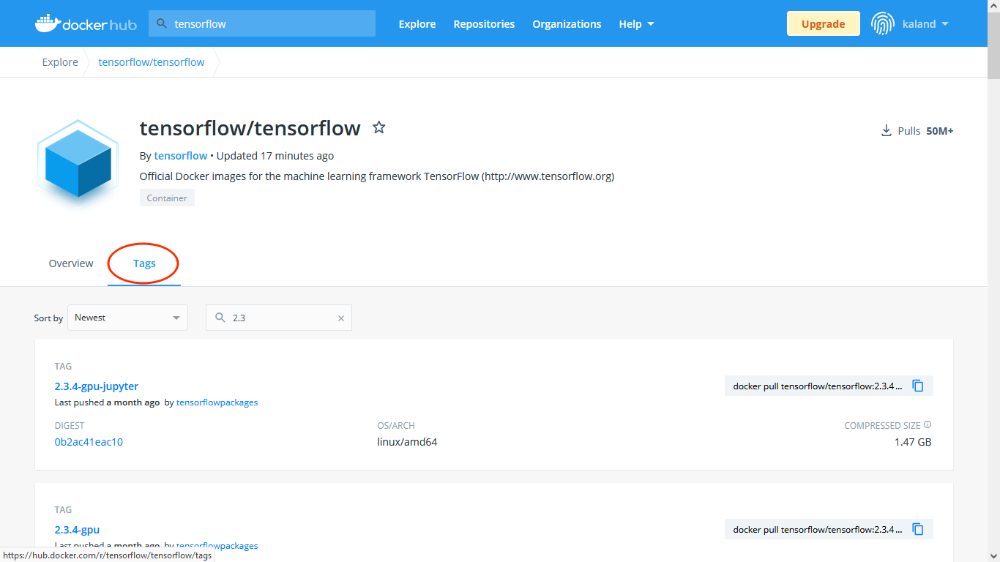
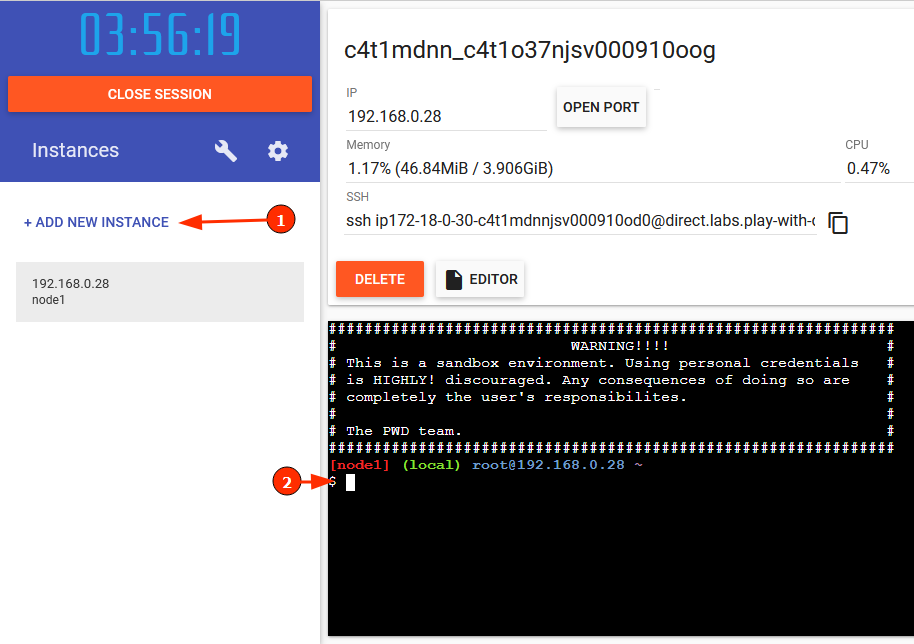

> Copyright Jelen text file a Budapesti Műszaki és Gazdaságtudományi Egyetemen tartott "Deep Learning a gyakorlatban Python és LUA alapon" tantárgy segédanyagaként készült. A tantárgy honlapja: http://smartlab.tmit.bme.hu/oktatas-deep-learning Deep Learning kutatás: http://smartlab.tmit.bme.hu/deep-learning Az anyag bármely részének újra felhasználása, publikálása csak a szerzők írásos beleegyezése esetén megengedett.
>
> 2021 (c) Gyires-Tóth Bálint (toth.b kukac tmit pont bme pont hu), Kalapos András

# Docker alapok

https://www.docker.com/
https://hu.wikipedia.org/wiki/Docker_(szoftver)

"Hasonló egy virtuális géphez, de nincs saját rendszermagja"

## Miért használunk dockert deep learninghez, gép tanuláshoz

- Projekt csomagolás 
  - szükséges driverek, linux csomagok
  - python csomagok 
  - fájlok
  - scriptek összefogása
- Tanító container 
  - Gyorsan telepíthető
  - Izolácó - könnyen elérhető, hogy csak annyi erőforráshoz, fájlokhoz férjetek hozzá
  - Kompatibilitás javítása
    - ha szerencsénk van elég egyszer vagy egyszer sem a GPU driver beállításával foglalkoznunk
    - mások könnyebben reprodukálhatják az eredményeink
  - Tanszéki GPU
- Alkalmazás container
  - Könnyű telepítés, skálázhatóság

## Docker hub

Előre összeállított Docker image-ek gyűjteménye: https://hub.docker.com/

Néhány példa: 

- https://hub.docker.com/_/python
- https://hub.docker.com/r/nvidia/cuda
- https://hub.docker.com/r/pytorch/pytorch
- https://hub.docker.com/r/tensorflow/tensorflow

Verziók keresése: Az egyes oldalak Overview fülén általában leírják, hogy melyik tag mit jelent, a Tags fülön pedig kereshetünk az összes lehetséges tag közül.

- `tensorflow/tensorflow:2.3.4-gpu-jupyter` -> tensorflow keretrendszer + GPU driverek + jupyter notebook + python
- `tensorflow/tensorflow:2.3.4` ->  tensorflow keretrendszer CPU-n futtatható változata + python
- `pytorch/pytorch:1.9.0-cuda10.2-cudnn7-runtime` -> pytorch keretrendszer + GPU driverek + python

## Alap parancsok bemutatása

:Docker alapok megismeréséhez online virtuális gép [Play-with docker](https://labs.play-with-docker.com/ )

- https://labs.play-with-docker.com/ 
- Docker Hub regisztráció után elérhető
- Virtuális gép indítása: 
- 

Töltsünk le egy python-t tartalmazó docker image-t! 

    docker pull python:latest

Majd futtassuk.

    docker run -it python:latest

* A `-it` kapcsoló(k): interaktív futtatás

- Ez a container egy python shellt indít el, most zárjuk be `Ctrl` + `D` -vel
- Ekkor leáll a containerünk

Futó containerek listázása:

    docker ps
    Eredmény:
    CONTAINER ID   IMAGE     COMMAND   CREATED   STATUS    PORTS     NAMES
    Nincs futó konténerünk, így a lista üres

Összes (akár nem futó) container listázása

    docker ps -a
    CONTAINER ID   IMAGE     COMMAND       CREATED       STATUS                      PORTS     NAMES
    5b8dab5c5640   test      "/bin/bash"   3 hours ago   Exited (0) 13 minutes ago             cool_morse

A letöltött image-ek istázása: 

    docker imges
    Eredmény:
    REPOSITORY   TAG           IMAGE ID       CREATED        SIZE
    python       3.8.12-slim   0b4039cc52c9   37 hours ago   122MB

**Image VS Container**: Az container az image egy példánya, amit használhatunk, futtathatunk mint virtuális gép

Containerek törlése (`rm` után  NAME, vagy CONTAINER ID)

    docker rm cool_morse

Érdemes lehet a `docker run`-t  `--rm ` kapcsolóval futtatni, így automatikusan törli a konténert, amikor leáll.

Image törlése  (`rmi` után  REPOSITORY:TAG, vagy IMAGE  ID)

    docker rmi docker rmi python:latest

## Saját container összeállítása

Egy példa projektet találtok itt: 

https://github.com/kaland313/vitmav45-template.git
A lényeges fájlok:

    ├── Dockerfile
    └── project
        └── hello_world.py

Dockerfile: egy recept az image elkészítéséhez:

    FROM python:3.8.12-slim
    RUN apt-get update -y && apt-get install -y --no-install-recommends \
        tmux \
        nano \
        htop
     
    RUN pip install numpy
    
    WORKDIR /workspace
    COPY project/* project/
    
    CMD ["/bin/bash"]

 Példa "projekt" letöltése githubról

    git clone  https://github.com/kaland313/vitmav45-template.git

Mappa váltás a letöltött repóba:

    cd vitmav45-template/ 

Saját container buildelése (automatikusan a mappában található Dockerfile alapján)

    docker build . -t test

Saját container futtatása

    docker run -it test

A saját containerben megtaláljuk a `project` mappában a `hello_world.py`-t, futtathatjuk is:

    python project/hello_world.py

## Docker telepítés

https://docs.docker.com/get-docker/ Itt windowsra, különböző linux disztribúciókra találhatunk utasításokat a telepítésre

GPU-eléréséhez `nvidia-docker`-t is telepítenünk kell.

Google keressék meg a részletes leírást az adott os-hez.
